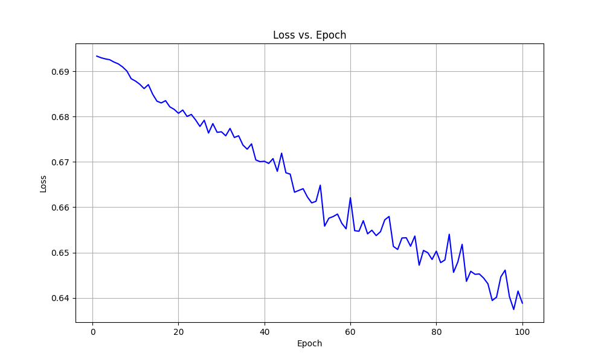
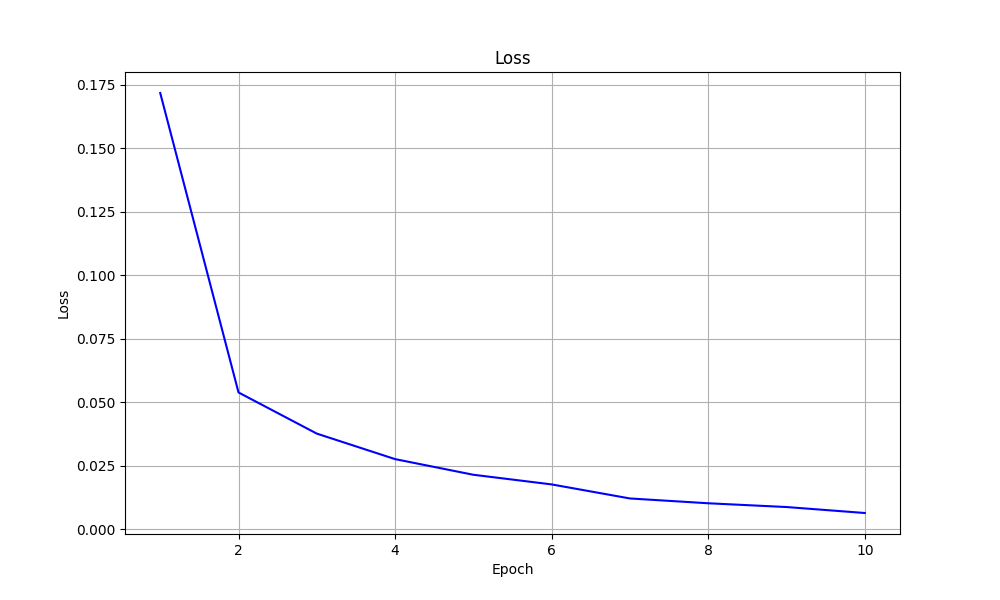
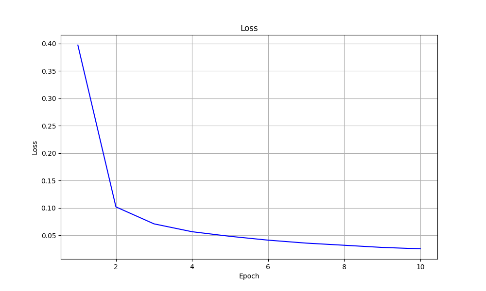

# 基础课程实践第一节第二部分练习报告

## 练习1：简单网络搭建

### 1. 网络结构
在 <mcfile name="practice_1.py" path="e:\基础项目实践\test_1\practice_1.py"></mcfile> 中实现了一个多层全连接网络（MLP）。网络结构如下：

- 输入层：10维输入
- 隐藏层：
  - 第一层：4个神经元
  - 第二层：8个神经元
  - 第三层：16个神经元
  - 第四层：4个神经元
- 输出层：2维输出

每个线性层之间使用ReLU激活函数。

### 2. 训练配置
- 随机生成1000个训练样本
- 批大小：32
- 优化器：Adam (lr=0.001)
- 损失函数：CrossEntropyLoss
- 训练轮次：100轮

### 3. 训练结果
- 使用matplotlib绘制了损失函数随epoch的变化曲线：

- 最后对10个随机生成的测试样本进行了预测

## 练习2：CNN模型训练（MNIST数据集）

### 1. 网络结构
在 <mcfile name="practice_2.py" path="e:\基础项目实践\test_1\practice_2.py"></mcfile> 中实现了一个简单的CNN网络，结构如下：

- 卷积层1：输入通道1，输出通道32，核大小3x3
- 卷积层2：输入通道32，输出通道64，核大小3x3
- 最大池化层：2x2
- 全连接层1：64*5*5 -> 128
- 全连接层2：128 -> 10（输出类别数）

### 2. 训练配置
- 数据集：MNIST手写数字识别
- 批大小：64
- 优化器：Adam (lr=0.0001)
- 损失函数：CrossEntropyLoss
- 训练轮次：10轮

### 3. 数据预处理
- 使用ToTensor()将图像转换为张量
- 使用Normalize进行标准化处理，均值0.1307，标准差0.3081

### 4. 训练与评估
- 实现了训练过程的loss监控和打印
- 每100个batch输出一次当前loss
- 每个epoch结束后计算平均loss
- 训练结束后进行模型评估，输出准确率
- 使用matplotlib可视化loss变化趋势

### 5. 超参数实验对比
针对学习率进行了对比实验，得到以下结果：

1. 学习率 = 0.001
   
   - 达到了最高的准确率：99.19%
   - 收敛速度较快

2. 学习率 = 0.0005
   
   - 准确率：99.00%
   - 收敛表现平稳

3. 学习率 = 0.0001
   
   - 准确率：98.99%
   - 收敛速度较慢，但训练过程更稳定

### 6. 实验结论
1. 学习率对模型性能有显著影响
2. 较大的学习率(0.001)能够达到更高的准确率，但可能存在训练不稳定的风险
3. 较小的学习率(0.0001)训练过程更加稳定，但收敛速度较慢
4. 中等学习率(0.0005)在训练稳定性和收敛速度之间取得了较好的平衡

## 版本管理
项目使用Git进行版本管理，所有代码和结果都已提交到仓库中。
